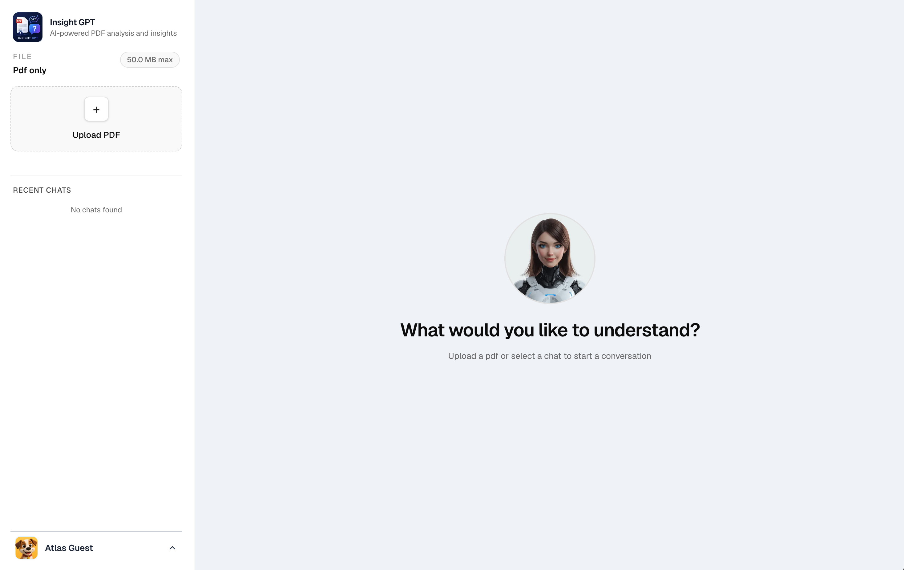
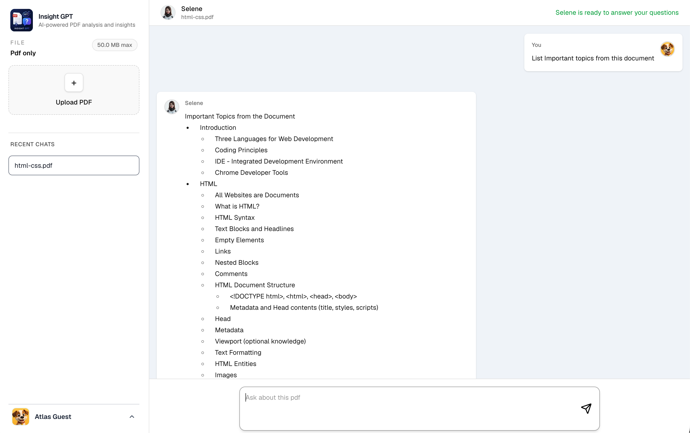

# Insight GPT

Production-ready Retrieval-Augmented Generation (RAG) platform built with Next.js, OpenAI, Qdrant, Supabase, Neon, and Trigger.dev.

Users can upload PDF documents, automatically index their content into a vector database, and chat with their documents using semantic search and AI-powered answers.

---

# Screenshot




## Features

### Document Management

* PDF upload
* Secure file storage with Supabase Storage
* Document status tracking
* Multi-document support
* User-level document isolation

### AI & RAG

* PDF text extraction
* Intelligent document chunking
* OpenAI embeddings
* Semantic vector search with Qdrant
* Context-aware answer generation
* Source retrieval
* Hallucination reduction through retrieval-first architecture

### Chat Experience

* Ask questions about uploaded PDFs
* AI-generated answers based only on document content
* Chat history persistence
* Multi-session support

### Background Processing

* Asynchronous document indexing
* Trigger.dev workflows
* Scalable ingestion pipeline
* Fault-tolerant processing

---

## Architecture

```text
User Uploads PDF
        │
        ▼
Supabase Storage
        │
        ▼
Trigger.dev Job
        │
        ▼
PDF Extraction
        │
        ▼
Chunking
        │
        ▼
OpenAI Embeddings
        │
        ▼
Qdrant Vector Database
        │
        ▼
-----
User Question
        │
        ▼
OpenAI Embedding
        │
        ▼
Qdrant Similarity Search
        │
        ▼
Relevant Chunks
        │
        ▼
GPT Context Generation
        │
        ▼
Answer
```

---

## Tech Stack

### Frontend

* Next.js 15
* React
* TypeScript
* Tailwind CSS

### Backend

* Next.js Route Handlers
* Server Actions
* Trigger.dev

### Databases

* Neon PostgreSQL
* Qdrant Vector Database

### Storage

* Supabase Storage

### AI

* OpenAI GPT Models
* OpenAI Embeddings

### ORM

* Prisma

---

## Database Design

### PostgreSQL (Neon)

Stores:

* Users
* Documents
* Chats
* Messages
* Metadata

### Qdrant

Stores:

* Vector embeddings
* Document chunks
* Search metadata

Example payload:

```json
{
  "userId": "user-id",
  "documentId": "document-id",
  "chunkIndex": 0,
  "content": "Chunk text"
}
```

---

## Project Structure

```text
src/

├── app/
│
├── features/
│   ├── documents/
│   ├── chat/
│   └── rag/
│
├── infrastructure/
│   ├── ai/
│   ├── database/
│   ├── storage/
│   └── vector-store/
│
├── jobs/
│   └── document-indexing/
│
├── shared/
│
└── config/
```

---

## RAG Pipeline

### 1. Upload

User uploads a PDF.

### 2. Storage

PDF is stored in Supabase Storage.

### 3. Indexing

Background Trigger.dev workflow:

* Download file
* Parse PDF
* Split into chunks
* Generate embeddings
* Store vectors in Qdrant

### 4. Retrieval

User asks a question.

System:

* Generates query embedding
* Searches Qdrant
* Retrieves relevant chunks

### 5. Generation

Retrieved context is sent to GPT.

Model generates an answer grounded in document content.

---

## Local Development

### Install Dependencies

```bash
npm install
```

### Environment Variables

```env
DATABASE_URL=

OPENAI_API_KEY=

QDRANT_URL=
QDRANT_API_KEY=

SUPABASE_URL=
SUPABASE_ANON_KEY=
SUPABASE_SERVICE_ROLE_KEY=

TRIGGER_SECRET_KEY=
```

### Run Application

```bash
npm run dev
```

### Run Trigger.dev

```bash
npm run trigger:dev
```

---

## Production Deployment

### Frontend & API

Deploy to Vercel.

### PostgreSQL

Neon

### Vector Database

Qdrant Cloud

### File Storage

Supabase Storage

### Background Jobs

Trigger.dev Cloud

---

## Security

* User-scoped vector search
* Row-level ownership validation
* Secure file storage
* Server-side OpenAI access
* No direct database exposure

---

## Future Improvements

* Streaming AI responses
* OCR support
* Multi-document conversations
* Team workspaces
* Hybrid search (keyword + vector)
* Document summaries
* Agent workflows

---

## License

MIT License

---

Built with Next.js, OpenAI, Qdrant, Neon, Supabase, and Trigger.dev.
