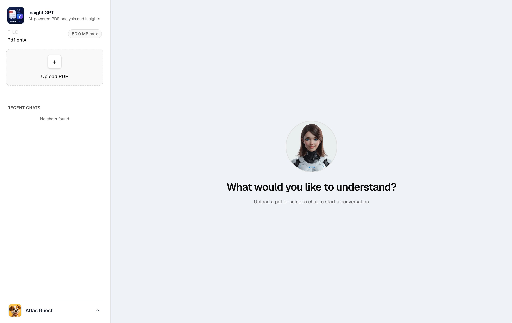
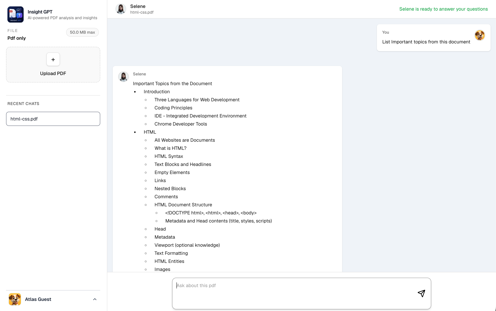
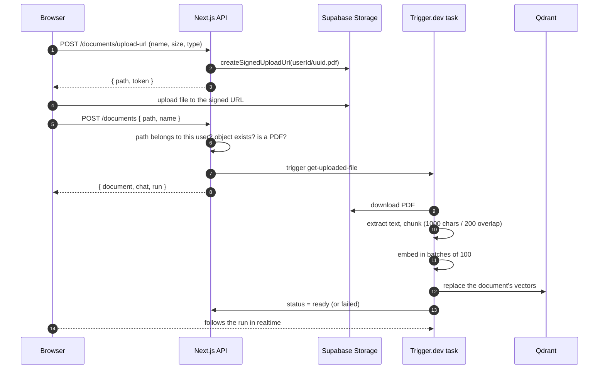
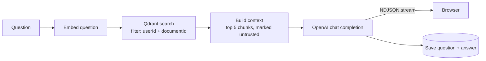

# Insight GPT

**Chat with your PDFs.** Upload a document, and ask questions in plain language. Answers stream back word by word, grounded only in what the document says.

[](https://github.com/kashyapkrlucky/insight-gpt/actions/workflows/ci.yml)


[](LICENSE)

A retrieval-augmented generation (RAG) app built with Next.js 16, OpenAI, Qdrant, Postgres (Neon), Supabase Storage and Trigger.dev.

---

## Screenshots




---

## Features

**Documents**
- Drag a PDF anywhere onto the window, or pick one from the upload screen (up to 50 MB).
- Uploads go straight to storage through a one-time signed URL. The server chooses the file path, so users can only write to their own folder.
- Indexing runs in the background. The chat shows live status (**Indexing**, **Ready** or **Failed**) and says why a document failed, for example a scanned PDF with no text.

**Chat**
- Answers stream in word by word.
- Answers come only from the document. The model is told to say so when the answer isn't in it.
- Starter questions on an empty chat, a copy button on answers and code blocks, and retry for a failed question.
- Each chat has its own URL (`/chat/[id]`), so refreshes and links work.
- The question and answer are saved together, and only once the answer is complete, so a failed answer never leaves a dangling question.

**Experience**
- Responsive layout: a slide-out drawer on phones and a collapsible sidebar on desktop.
- Light, dark and system themes, with no flash of the wrong theme on load.
- Keyboard shortcuts: <kbd>⌘</kbd>/<kbd>Ctrl</kbd>+<kbd>K</kbd> for a new chat, <kbd>⌘</kbd>/<kbd>Ctrl</kbd>+<kbd>B</kbd> to toggle the sidebar, <kbd>/</kbd> to focus the message box.
- Chats grouped by date, with search and a confirmation before deleting.
- Accessible: labelled controls, visible focus, a native `<dialog>` for confirmations, and support for reduced motion.

**Security**
- Access tokens are checked for signature, algorithm, issuer, audience and expiry. Refresh tokens are rejected as access tokens.
- Every database query and vector search is scoped to the signed-in user.
- Per-user rate limits, with lower limits for guests.
- Request validation with zod. Document text is wrapped and marked as untrusted in the prompt, to resist prompt injection.
- Security headers, and `server-only` guards on server code.

---

## How it works

### Indexing a document


```mermaid
sequenceDiagram
    autonumber
    participant B as Browser
    participant A as Next.js API
    participant S as Supabase Storage
    participant T as Trigger.dev task
    participant Q as Qdrant

    B->>A: POST /documents/upload-url (name, size, type)
    A->>S: createSignedUploadUrl(userId/uuid.pdf)
    A-->>B: { path, token }
    B->>S: upload file to the signed URL
    B->>A: POST /documents { path, name }
    A->>A: path belongs to this user? object exists? is a PDF?
    A->>T: trigger get-uploaded-file
    A-->>B: { document, chat, run }
    T->>S: download PDF
    T->>T: extract text, chunk (1000 chars / 200 overlap)
    T->>T: embed in batches of 100
    T->>Q: replace the document's vectors
    T->>A: status = ready (or failed)
    B-->>T: follows the run in realtime
```

### Answering a question


```mermaid
flowchart LR
    Q[Question] --> E[Embed question]
    E --> R["Qdrant search<br/>filter: userId + documentId"]
    R --> C["Build context<br/>top 5 chunks, marked untrusted"]
    C --> G[OpenAI chat completion]
    G -- NDJSON stream --> UI[Browser]
    G --> DB[(Save question + answer)]
```

`POST /api/v1/search` returns errors found before generation starts (auth, validation, ownership, rate limit, retrieval) as JSON with a status code. After that it streams [NDJSON](https://github.com/ndjson/ndjson-spec), one event per line:

```jsonc
{ "type": "delta", "text": "The report" }
{ "type": "done",  "message": { "id": "…", "author": "assistant", "content": "…" } }
{ "type": "error", "error": "Failed to generate an answer. Please try again." }
```

### Design decisions

| Decision | Why |
|---|---|
| **Signed upload URLs** instead of the browser writing with the public key | Users sign in with Atlas ID, not Supabase Auth, so storage policies can't tell users apart. With signed URLs the bucket stays private and the server chooses every path. |
| **Trigger.dev for indexing** | Parsing and embedding a large PDF can run past serverless timeouts. Runs retry, can be followed in realtime, and a PDF with no text stops immediately with `AbortTaskRunError`. |
| **Qdrant with payload filters** | Searches filter on the `userId` and `documentId` keyword indexes, so a query can't reach another user's vectors. |
| **NDJSON streaming** over `fetch` | It's simple to produce and to parse, carries typed events (delta, done, error), and works with the existing token refresh. |
| **One shared embedding model setting** | Vectors from different models can't be compared, so indexing and questions both read `EMBEDDING_MODEL`. |

---

## Tech stack

| Layer | Technology |
|---|---|
| Framework | Next.js 16 (App Router, Route Handlers), React 19, TypeScript 5 |
| UI | Tailwind CSS 4, lucide-react, react-markdown + remark-gfm, react-hot-toast |
| State | Zustand |
| Database | PostgreSQL (Neon) via Prisma 7 and the `pg` adapter |
| Vector store | Qdrant (`text-embedding-3-small`, 1536 dimensions, cosine) |
| Storage | Supabase Storage (private bucket, signed uploads) |
| Background jobs | Trigger.dev v4 |
| AI | OpenAI embeddings and chat completions |
| Auth | [Atlas ID](https://atlas-id.vercel.app), an external OAuth provider issuing RS256 JWTs, with guest sign-in |
| Testing | Vitest, Testing Library, jsdom |

---

## Project structure

```text
src/
├── app/
│   ├── (app)/                 # Signed-in area: auth gate, sidebar shell, shortcuts, file drop
│   │   ├── page.tsx           # New chat / upload screen
│   │   └── chat/[id]/         # A chat
│   ├── (auth)/login/          # Sign-in page
│   └── api/v1/                # Route handlers (see API below)
├── features/
│   ├── auth/                  # Client auth store, and server/jwt.ts for token checks
│   ├── chats/                 # Components, store, hooks, date grouping
│   └── rag/                   # Embed question, retrieve, build context, stream answer
├── infra/
│   ├── ai/                    # OpenAI client and embedding model setting
│   ├── db/                    # Prisma client
│   ├── ingestion/             # PDF parsing, chunking, batched embeddings
│   ├── storage/               # Supabase clients, signed uploads, path ownership
│   └── vectorDB/              # Qdrant client, save and remove vectors
├── jobs/document/             # Trigger.dev tasks: index and remove a document
├── shared/
│   ├── lib/api/               # withAuth wrapper, ApiError, rate limiter
│   ├── lib/http/              # axios client (with token refresh) and NDJSON stream client
│   ├── ui/                    # Button, ConfirmDialog, CopyButton, ThemeToggle, …
│   ├── hooks/ store/          # Keyboard shortcuts, media query, theme and sidebar state
│   └── constants/ utils/
├── styles/index.css           # Design tokens (light and dark)
└── test/                      # Test setup and API test helpers
```

---

## API

All endpoints need `Authorization: Bearer <access token>` and return errors as `{ "error": string, "code": string }`.

| Method | Endpoint | Description |
|---|---|---|
| `POST` | `/api/v1/documents/upload-url` | Issue a signed upload URL for a PDF (rate limited) |
| `POST` | `/api/v1/documents` | Register an uploaded PDF, create its chat and start indexing |
| `GET` | `/api/v1/chats` | The user's chats, newest first, with document status |
| `GET` | `/api/v1/chats/:id` | One chat, with document status |
| `DELETE` | `/api/v1/chats/:id` | Delete the chat, its document and messages, then clean up storage and vectors |
| `GET` | `/api/v1/chats/:id/messages` | Messages, oldest first |
| `POST` | `/api/v1/search` | Ask a question. Streams NDJSON (rate limited) |
| `GET` | `/api/v1/health` | Health check |

Rate limits: questions 30 per minute (guests 10), uploads 20 per hour (guests 5).

---

## Getting started

### Prerequisites

- Node.js 22 or later
- The [Atlas ID](https://atlas-id.vercel.app) auth server running on `http://localhost:3000`, with an OAuth client registered for this app
- Accounts for Neon (or any Postgres), Supabase, Qdrant Cloud, OpenAI and Trigger.dev

### 1. Install

```bash
npm install
```

### 2. Configure the environment

```bash
cp .env.example .env
```

Fill in the values. [`.env.example`](.env.example) explains each one. The key ones:

| Variable | Notes |
|---|---|
| `NEXT_PUBLIC_CLIENT_ID` | Your Atlas ID OAuth client. Also the expected token audience. |
| `JWT_PUBLIC_KEY` | Atlas ID's RS256 public key (PEM) |
| `JWT_AUDIENCE` | Optional, comma-separated. Add Atlas ID's `APP_ID` if you use guest sign-in, because guest tokens are issued with that audience. |
| `SUPABASE_SERVICE_ROLE_KEY` | Server only. Used to sign uploads and to download files for indexing. |
| `AI_MODEL_TEXT_SMALL` / `AI_MODEL_CHAT` | Embedding and chat models (defaults: `text-embedding-3-small`, `gpt-5-mini`) |

### 3. Set up the services

**Database**

```bash
npx prisma migrate deploy
```

**Supabase Storage:** create a **private** bucket named `insight-pdf`, or whatever you set in `NEXT_PUBLIC_SUPABASE_BUCKET_NAME`. Uploads use signed URLs, so the bucket needs **no** public or anonymous policies.

**Qdrant:** create the collection and the keyword indexes the search filters need. Qdrant Cloud's strict mode rejects filters on fields that aren't indexed.

```bash
curl -X PUT "$QDRANT_URL/collections/insight-pdf" -H "api-key: $QDRANT_API_KEY" \
  -H 'content-type: application/json' -d '{"vectors":{"size":1536,"distance":"Cosine"}}'

for field in userId documentId; do
  curl -X PUT "$QDRANT_URL/collections/insight-pdf/index" -H "api-key: $QDRANT_API_KEY" \
    -H 'content-type: application/json' -d "{\"field_name\":\"$field\",\"field_schema\":\"keyword\"}"
done
```

### 4. Run it

In two terminals:

```bash
npm run dev          # app on http://localhost:3001
```

```bash
npm run trigger:dev  # runs background tasks locally, reloads on change
```

Open http://localhost:3001 and sign in with Atlas ID, or continue as a guest.

### Scripts

| Script | Description |
|---|---|
| `npm run dev` | Dev server on port 3001 |
| `npm run build` | `prisma generate` and a production build |
| `npm start` | Production server on port 3001 |
| `npm run trigger:dev` | Trigger.dev dev worker |
| `npm test` / `npm run test:watch` | Vitest |
| `npm run lint` | ESLint |
| `npm run typecheck` | `tsc --noEmit` |

---

## Testing

```bash
npm test
```

The suite of 170+ tests runs in CI on every push and pull request, together with lint and a production build. It covers:

- **Security:** token checks (issuer, audience, algorithm, refresh-token rejection), storage path ownership (other users' folders, path traversal), per-user scoping on every route, validation, and rate limits.
- **API routes:** status codes, ordering, the streamed NDJSON events, and saving nothing when generation fails.
- **Indexing:** status changes, a PDF with no text stopping without retries, clearing vectors before saving, and embedding batches.
- **Client:** chat store streaming, retry, deep links and upload flow, the NDJSON parser and its token refresh, and date grouping.

---

## Deployment

**App:** deploy to Vercel or any Node host. Set the same variables as `.env.example`. Use the **production** `TRIGGER_SECRET_KEY` (`tr_prod_…`).

**Background tasks:** tasks run on Trigger.dev's infrastructure, so deploy them separately whenever code under `src/jobs/` (or anything it imports) changes:

```bash
npx trigger.dev@4.5.16 deploy
```

Deployed tasks don't read your `.env`. Set these in the Trigger.dev dashboard for the prod environment: `DATABASE_URL`, `AI_API_KEY`, `AI_MODEL_TEXT_SMALL`, `QDRANT_URL`, `QDRANT_API_KEY`, `NEXT_PUBLIC_SUPABASE_URL`, `SUPABASE_SERVICE_ROLE_KEY`, `NEXT_PUBLIC_SUPABASE_BUCKET_NAME`.

---

## Known limitations

- **No OCR.** Scanned PDFs, and PDFs whose text was converted to shapes, can't be indexed. They fail with a clear message.
- **Rate limits are kept in memory,** so each server instance counts separately. Use a shared store such as Redis before scaling out.
- **Access tokens are stored in `localStorage`.** Moving them to httpOnly cookies is planned.
- **Guest users share one account in Atlas ID,** so guests can see each other's chats. This needs fixing in the auth server.
- **One document per chat,** with no conversation memory: each question is answered on its own.
- The failure reason isn't stored yet, so after a reload a failed document shows a general message.

## Roadmap

Prioritised in [improvements.md](improvements.md). Highlights:

- [ ] Citations: page numbers per chunk, and source markers that open the PDF at the right page
- [ ] A PDF viewer beside the chat
- [ ] OCR fallback for scanned PDFs
- [ ] Conversation memory and query rewriting for follow-up questions
- [ ] Hybrid search (BM25 and dense vectors) with re-ranking
- [ ] A RAG evaluation suite (retrieval hit rate, faithfulness) that runs in CI
- [ ] httpOnly cookie sessions, a Content-Security-Policy, and Redis-backed rate limits

---

## License

[MIT](LICENSE) © 2026 Lucky Kashyap
